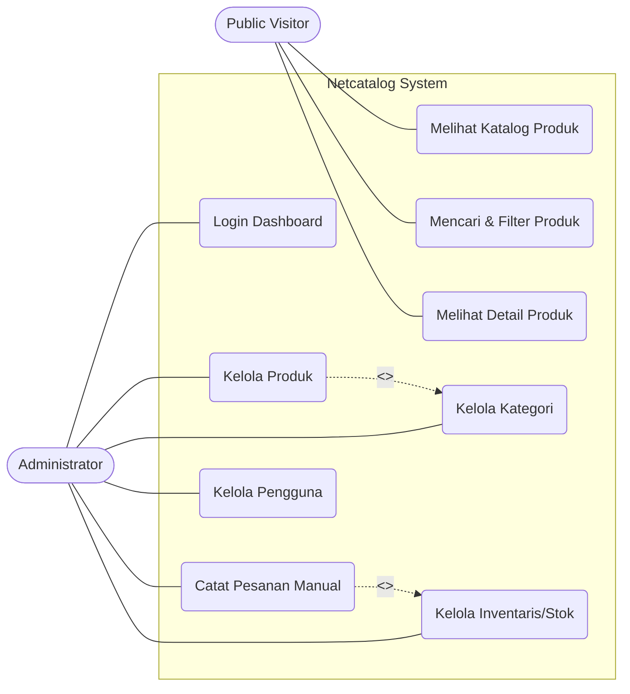
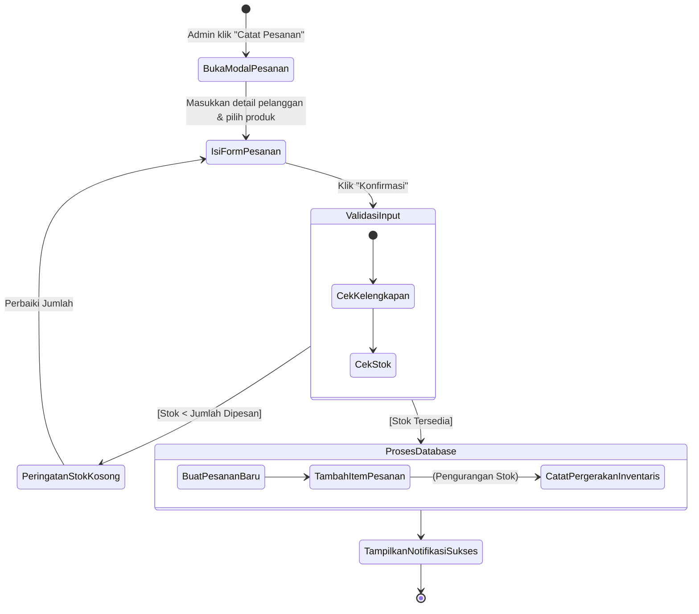
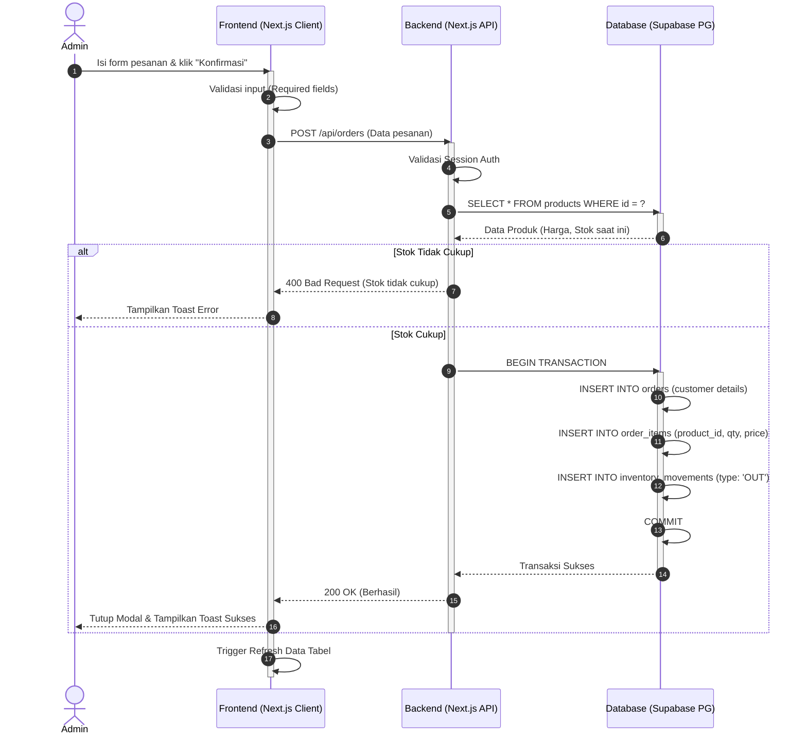
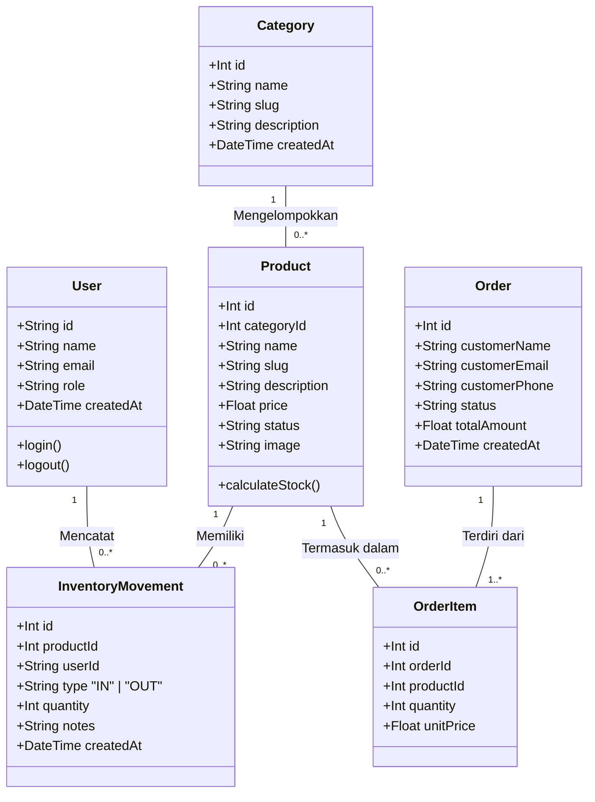

# DOKUMEN DESAIN SISTEM (D2)
**Product Catalog with Stock Count (Netcatalog)**

## 1. Pendahuluan

### 1.1. Latar Belakang Sistem
Pengelolaan data produk dan informasi stok merupakan hal krusial dalam kegiatan operasional usaha. Pencatatan manual seringkali mengakibatkan proses pencarian data, pembaruan stok, maupun penyajian informasi menjadi tidak efisien. Seiring perkembangan teknologi, sistem berbasis web hadir sebagai solusi terstruktur. 

Sistem *Catalog Product with Count* (Netcatalog) dikembangkan sebagai aplikasi web untuk menampilkan katalog produk lengkap dengan ketersediaan stok secara *real-time*. Sistem ini memfasilitasi pengguna publik untuk mencari produk dengan mudah, sekaligus memberikan *dashboard* manajemen terpusat bagi admin dan staf gudang untuk mengontrol inventaris, produk, serta mencatat pesanan.

### 1.2. Tujuan Dokumen
Dokumen Desain Sistem (D2) ini disusun bertujuan untuk menjabarkan rancangan arsitektur, pemodelan data, pemodelan proses, dan struktur interaksi dari sistem Netcatalog. Dokumen ini bertindak sebagai acuan teknis (*blueprint*) bagi tim pengembang (*developer*) dalam mengimplementasikan sistem agar selaras dengan spesifikasi kebutuhan yang telah didefinisikan pada dokumen Proposal Proyek / SRS (D1).

### 1.3. Ruang Lingkup Sistem
Berdasarkan dokumen D1, ruang lingkup rancangan sistem mencakup:
1. Perancangan aplikasi berbasis web dengan dua antarmuka: Halaman Katalog (Pelanggan) dan Dashboard (Admin).
2. Mekanisme autentikasi (login) khusus untuk administrator.
3. Fitur pengelolaan data produk (CRUD) dan manajemen kategori produk.
4. Fitur pelacakan jumlah stok produk melalui pencatatan pergerakan inventaris.
5. Katalog produk publik interaktif yang menampilkan jumlah stok tersedia tanpa hak akses edit.
6. Basis data untuk penyimpanan terpusat.
7. *Sistem tidak mencakup fitur keranjang belanja, checkout pembayaran (payment gateway), atau transaksi e-commerce secara langsung oleh pelanggan.*

### 1.4. Referensi
- Dokumen (D1) Proposal Proyek Rekayasa Perangkat Lunak: *Product Catalog with Stock Count*, Universitas Diponegoro (2026).
- Spesifikasi *Unified Modeling Language* (UML) untuk pemodelan sistem visual.

---

## 2. Ringkasan Sistem (System Overview)

### 2.1. Deskripsi Umum Sistem
Netcatalog adalah platform manajemen katalog yang menjembatani informasi stok antara staf internal dengan pelanggan publik. Sistem memiliki halaman *Catalog* tempat pengunjung dapat memfilter, mencari, dan melihat detail produk beserta stok yang tersedia tanpa perlu mendaftar. Di balik layar, terdapat *Dashboard Admin* aman yang dikendalikan oleh staf internal untuk mengupdate produk, menyesuaikan stok barang secara dinamis melalui riwayat pergerakan barang, dan mencatat pesanan *offline* yang terintegrasi langsung dengan pengurangan inventaris secara otomatis.

### 2.2. Stakeholder dan Aktor Sistem
Berdasarkan analisis kebutuhan, aktor sistem terbagi menjadi:
1. **Pelanggan (User / Visitor)**: Aktor publik yang mengakses halaman web untuk melihat daftar katalog produk, menelusuri kategori, dan memastikan ketersediaan barang sebelum memutuskan pembelian secara *offline*.
2. **Admin / Pengelola Toko**: Aktor internal yang memiliki otorisasi untuk mengakses *Dashboard*. Bertanggung jawab melakukan penambahan produk, mutasi stok, hingga pengelolaan pesanan masuk.
3. **Tim Pengembang (Developer)**: Aktor teknis yang bertugas merancang arsitektur (frontend/backend) serta memelihara *database* dan *server*.

### 2.3. Ringkasan Kebutuhan Fungsional (dari SRS)
Sistem memiliki serangkaian fitur fungsional utama (*Must Have* & *Should Have*):
- **FR-01 (Autentikasi)**: Akses terbatas (login) ke sistem dasbor.
- **FR-02 & FR-05 (Katalog & Pencarian)**: Sistem menampilkan daftar produk yang dapat dicari dan difilter berdasarkan nama atau rentang kategori.
- **FR-03 & FR-07 (Manajemen Produk & Kategori)**: Admin mampu melakukan operasi CRUD untuk mengelola informasi detail produk dan kategori.
- **FR-04 (Otomasi Inventaris)**: Pencatatan pergerakan inventaris otomatis yang mengurangi jumlah stok ketika terjadi transaksi.
- **FR-06 (Sistem Peringatan)**: Indikator visual ketika stok produk berada di bawah batas minimum (hampir habis/habis).

### 2.4. Batasan dan Asumsi Sistem
**Batasan Sistem:**
1. Integritas Data (NFR-01): Kalkulasi stok dikerjakan secara ketat berdasarkan riwayat barang masuk/keluar, tidak boleh ada selisih data.
2. Platform Akses: Sistem dikembangkan berbasis *web* yang berjalan di peramban (browser) modern, bukan aplikasi *native mobile*.

**Asumsi Sistem:**
1. Administrator sistem memiliki keterampilan teknis dasar dalam mengoperasikan aplikasi manajemen berbasis antarmuka web.
2. Proses persetujuan pembayaran dan pengiriman barang diurus sepenuhnya di luar sistem aplikasi ini (dilakukan secara manual/eksternal).

---

# 3. Model Sistem

Dokumen ini memuat pemodelan sistem untuk platform **Netcatalog** menggunakan standar UML (Unified Modeling Language), mencakup interaksi pengguna, alur proses, interaksi komponen, dan struktur data.

---

## 3.1. Use Case Diagram (WAJIB)

### a. Diagram Use Case


### b. Identifikasi Aktor
1. **Public Visitor**: Pengguna umum yang mengakses landing page dan katalog produk tanpa perlu login.
2. **Administrator**: Pengguna internal/staf yang memiliki akses penuh ke sistem dashboard untuk mengelola seluruh data platform.

### c. Relasi (Include, Extend, Generalization)
- **`<<include>>` Catat Pesanan Manual -> Kelola Inventaris**: Setiap kali Admin mencatat pesanan, sistem secara otomatis *meng-include* proses pengurangan stok di Inventaris.
- **`<<include>>` Kelola Produk -> Kelola Kategori**: Saat mengelola produk, Admin berelasi dengan data kategori untuk pengelompokan.

### d. Deskripsi Singkat Tiap Use Case
- **Melihat Katalog Produk**: Visitor dapat melihat daftar perangkat jaringan yang tersedia.
- **Mencari & Filter Produk**: Visitor dapat mencari berdasarkan nama atau memfilter berdasarkan kategori.
- **Login Dashboard**: Admin melakukan autentikasi email dan password untuk masuk ke area administratif.
- **Kelola Produk**: Admin dapat menambah, mengubah, atau menghapus data perangkat jaringan.
- **Catat Pesanan Manual**: Admin mencatat transaksi penjualan ke pelanggan (offline/manual sales).
- **Kelola Inventaris/Stok**: Admin dapat menambah stok (restock) atau melihat riwayat pergerakan barang masuk/keluar.

---

## 3.2. Activity Diagram (WAJIB)

Diagram ini menggambarkan alur inti saat Admin mencatat pesanan baru, yang melibatkan *decision* pengecekan stok dan *parallel flow* (jika ada).

### Alur Proses Utama: Pencatatan Pesanan (Log Order) & Penyesuaian Stok



**Deskripsi Proses**:
1. Admin membuka form modal untuk mencatat pesanan.
2. Admin mengisi data pelanggan, produk, dan kuantitas.
3. Sistem melakukan *Decision*: Mengecek ketersediaan stok produk.
4. Jika stok kurang, alur dikembalikan ke form dengan pesan error.
5. Jika stok cukup, sistem melakukan *sequence* ke database: Membuat Order, mencatat Order Items, dan memotong kuantitas di Inventory Movements secara transaksional.

---

## 3.3. Sequence Diagram (DISARANKAN)

Skenario: **Admin Melakukan Pencatatan Pesanan (Transaksi)**



---

## 3.4. Class Diagram (WAJIB)

Class Diagram ini merepresentasikan entitas utama dalam sistem dan *mapping* langsung ke skema Database (ERD) prisma/drizzle yang digunakan.



**Atribut dan Method (Relasi ke ERD)**:
- **Product & Category**: Relasi *One-to-Many* (Aggregation). Satu kategori bisa memiliki banyak produk.
- **Product & InventoryMovement**: Sistem tidak menyimpan field `stock` statis di tabel Product, melainkan menghitung (*calculateStock*) dari agregasi tabel `InventoryMovement`. Ini adalah pola *Event Sourcing* sederhana.
- **Order & OrderItem**: Relasi *Composition*, di mana OrderItem tidak bisa berdiri sendiri tanpa Order.

---

## 3.5. Opsi Nilai Tambah (Deployment Diagram)

Arsitektur Fisik (Deployment) yang menunjukkan lokasi komponen di-hosting.

```mermaid
graph TD
    UserClient[Browser Pengguna / Admin]
    
    subgraph Vercel Cloud Platform
        NextJSFrontend[Next.js Frontend\n(React Server Components)]
        NextJSAPI[Next.js API Routes\n(Serverless Functions)]
    end
    
    subgraph Supabase Platform
        PGBouncer[Connection Pooler\nPort 6543]
        PGDatabase[(PostgreSQL Database)]
    end
    
    subgraph External Services
        Cloudinary[(Cloudinary\nImage CDN)]
    end

    UserClient <-->|HTTPS| NextJSFrontend
    UserClient <-->|HTTPS| NextJSAPI
    
    NextJSFrontend -->|Fetch Images| Cloudinary
    
    NextJSAPI <-->|TCP/IP SQL Query| PGBouncer
    PGBouncer <--> PGDatabase
```
