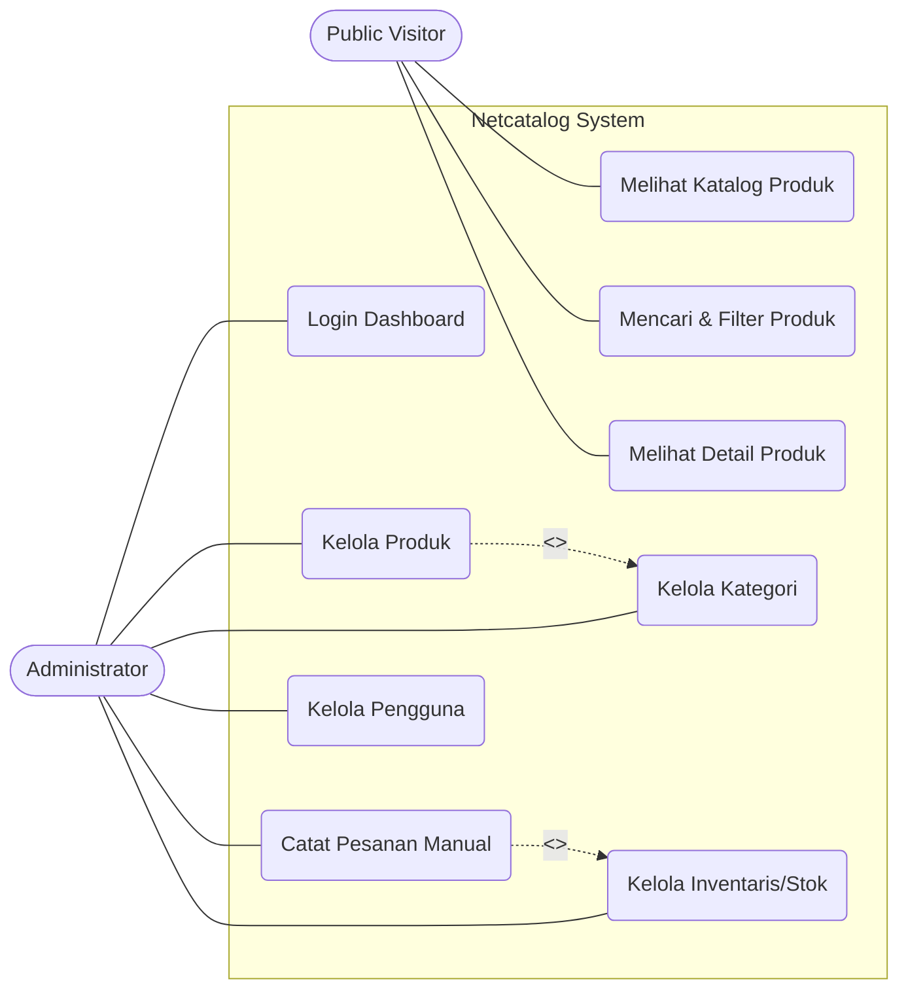
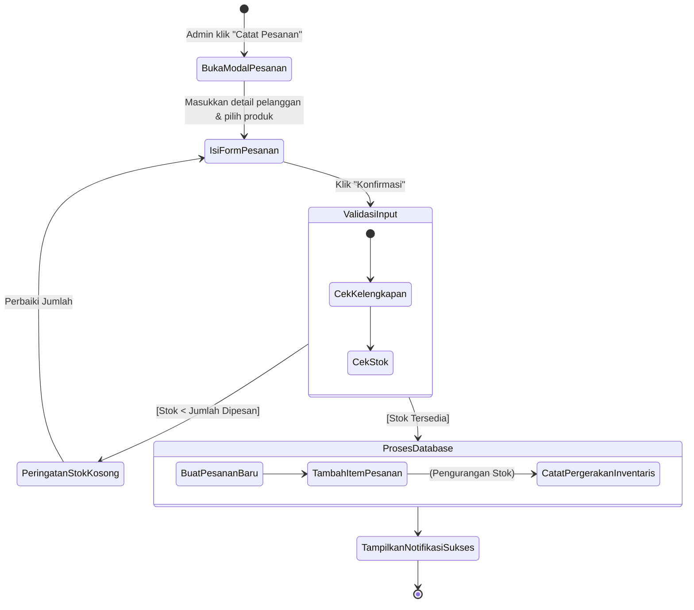
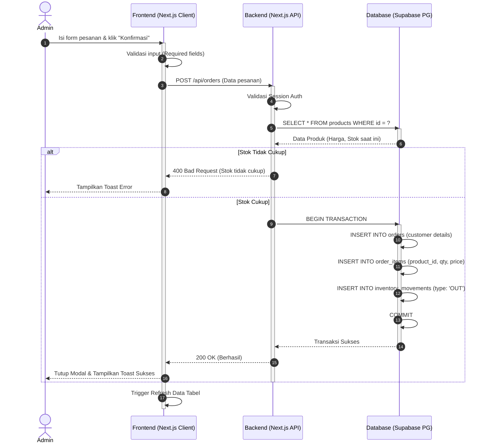
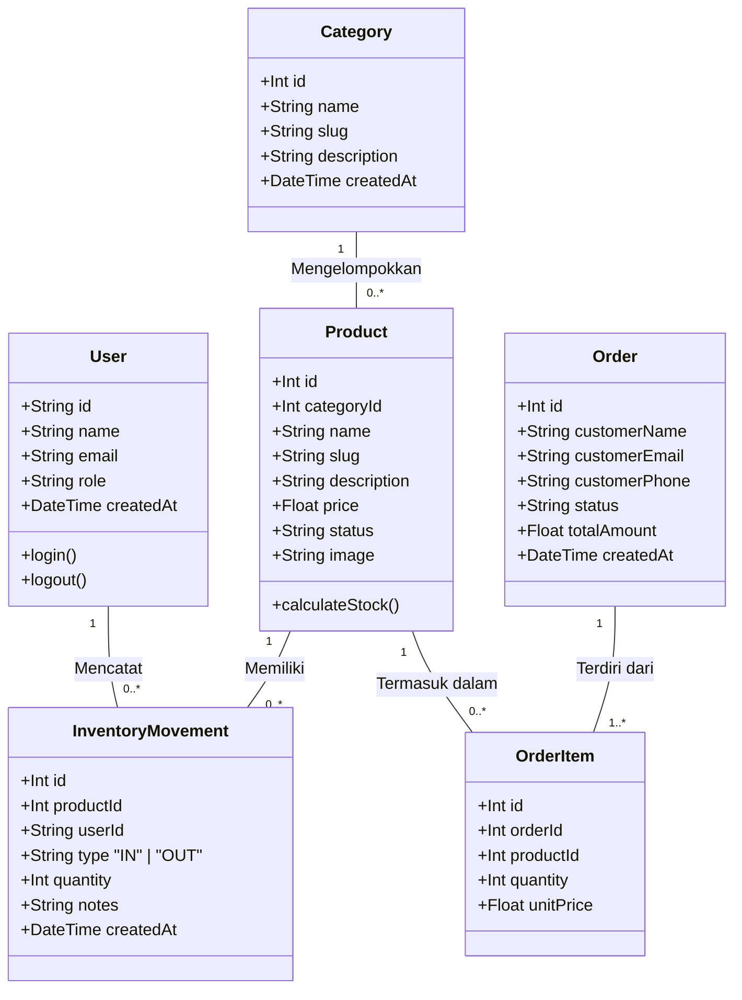

# Bab 3. Model Sistem

Dokumen ini memuat pemodelan sistem untuk platform **Netcatalog** menggunakan standar UML (Unified Modeling Language), mencakup interaksi pengguna, alur proses, interaksi komponen, dan struktur data.

---

## 3.1. Use Case Diagram (WAJIB)

### a. Diagram Use Case


### b. Identifikasi Aktor
1. **Public Visitor**: Pengguna umum yang mengakses landing page dan katalog produk tanpa perlu login.
2. **Administrator**: Pengguna internal/staf yang memiliki akses penuh ke sistem dashboard untuk mengelola seluruh data platform.

### c. Relasi (Include, Extend, Generalization)
- **`<<include>>` Catat Pesanan Manual -> Kelola Inventaris**: Setiap kali Admin mencatat pesanan, sistem secara otomatis *meng-include* proses pengurangan stok di Inventaris.
- **`<<include>>` Kelola Produk -> Kelola Kategori**: Saat mengelola produk, Admin berelasi dengan data kategori untuk pengelompokan.

### d. Deskripsi Singkat Tiap Use Case
- **Melihat Katalog Produk**: Visitor dapat melihat daftar perangkat jaringan yang tersedia.
- **Mencari & Filter Produk**: Visitor dapat mencari berdasarkan nama atau memfilter berdasarkan kategori.
- **Login Dashboard**: Admin melakukan autentikasi email dan password untuk masuk ke area administratif.
- **Kelola Produk**: Admin dapat menambah, mengubah, atau menghapus data perangkat jaringan.
- **Catat Pesanan Manual**: Admin mencatat transaksi penjualan ke pelanggan (offline/manual sales).
- **Kelola Inventaris/Stok**: Admin dapat menambah stok (restock) atau melihat riwayat pergerakan barang masuk/keluar.

---

## 3.2. Activity Diagram (WAJIB)

Diagram ini menggambarkan alur inti saat Admin mencatat pesanan baru, yang melibatkan *decision* pengecekan stok dan *parallel flow* (jika ada).

### Alur Proses Utama: Pencatatan Pesanan (Log Order) & Penyesuaian Stok



**Deskripsi Proses**:
1. Admin membuka form modal untuk mencatat pesanan.
2. Admin mengisi data pelanggan, produk, dan kuantitas.
3. Sistem melakukan *Decision*: Mengecek ketersediaan stok produk.
4. Jika stok kurang, alur dikembalikan ke form dengan pesan error.
5. Jika stok cukup, sistem melakukan *sequence* ke database: Membuat Order, mencatat Order Items, dan memotong kuantitas di Inventory Movements secara transaksional.

---

## 3.3. Sequence Diagram (DISARANKAN)

Skenario: **Admin Melakukan Pencatatan Pesanan (Transaksi)**



---

## 3.4. Class Diagram (WAJIB)

Class Diagram ini merepresentasikan entitas utama dalam sistem dan *mapping* langsung ke skema Database (ERD) prisma/drizzle yang digunakan.



**Atribut dan Method (Relasi ke ERD)**:
- **Product & Category**: Relasi *One-to-Many* (Aggregation). Satu kategori bisa memiliki banyak produk.
- **Product & InventoryMovement**: Sistem tidak menyimpan field `stock` statis di tabel Product, melainkan menghitung (*calculateStock*) dari agregasi tabel `InventoryMovement`. Ini adalah pola *Event Sourcing* sederhana.
- **Order & OrderItem**: Relasi *Composition*, di mana OrderItem tidak bisa berdiri sendiri tanpa Order.

---

## 3.5. Opsi Nilai Tambah (Deployment Diagram)

Arsitektur Fisik (Deployment) yang menunjukkan lokasi komponen di-hosting.

```mermaid
graph TD
    UserClient[Browser Pengguna / Admin]
    
    subgraph Vercel Cloud Platform
        NextJSFrontend[Next.js Frontend\n(React Server Components)]
        NextJSAPI[Next.js API Routes\n(Serverless Functions)]
    end
    
    subgraph Supabase Platform
        PGBouncer[Connection Pooler\nPort 6543]
        PGDatabase[(PostgreSQL Database)]
    end
    
    subgraph External Services
        Cloudinary[(Cloudinary\nImage CDN)]
    end

    UserClient <-->|HTTPS| NextJSFrontend
    UserClient <-->|HTTPS| NextJSAPI
    
    NextJSFrontend -->|Fetch Images| Cloudinary
    
    NextJSAPI <-->|TCP/IP SQL Query| PGBouncer
    PGBouncer <--> PGDatabase
```
